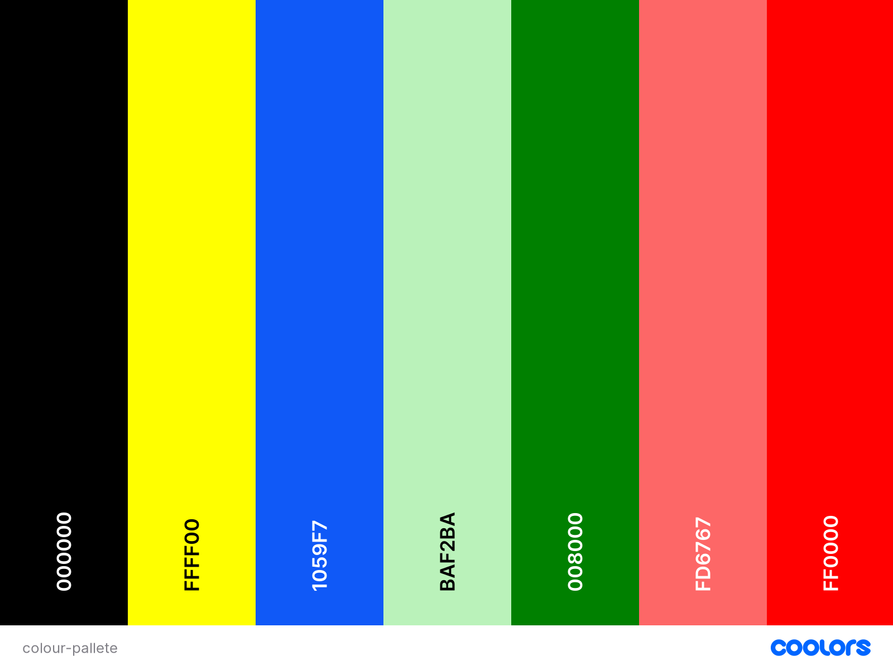

#The Movie Quiz  

This movie quiz is a simple quiz about famous films and some of the famous quotes that have gone viral in the world. This quiz is to test their knowledge on the films and see how much they know. There will be four questions with a choice of two answers which will be shown as green for correct and red for an incorrect answer.

##Live website

[]<https://jessicarosed1.github.io/Movie-and-Series-Quiz/>

##Repository  

[]<https://github.com/JessicaroseD1/Movie-and-Series-Quiz>

##Overview

The overview of the game is to test their knowledge with some simple questions about famous films with a bit a range of questions so that I can cater to a wider audience. The overall objective is to have a fun simple game where they can get a quiz like feel from it.

##Website Structure

The contents of the game is being held on a single HTML page, JavaScript coding is all in script.js which are being used to hide and unhide parts of the main sections of the main page based on the interactions with the user. For example, you will see on the main page that there is a welcome message, however when the user clicks Start Game, the introduction message will disappear. Once the game has started a series of randomised questions is displayed which can be found at the bottom of the script.js.

###Colour Scheme  

The colour scheme has been chosen to be contrasting to the background which is a combination of colours. Therefore I chose a container box colour of FFFF00. For the text I used 000000. The reason that I chose this text colour is so that it looks aesthetically pleasing however also ensuring that the text is user friendly and is able to be read against a demanding background.

Upon the game starting the colour scheme that I have chosen for the buttons is to now have a hover colour of 1059F7 so that the audience can visibly see a difference when they hit the start button. To show that the answer was correct i have used BAF2BA with a hover button colour of 008000 for when the answer was wrong I had used FD6767 with a hover colour effect of FF0000. 

The colours that are being used throughout are consistent and the idea behind this was so that it produced a clean game where the users can concentrate on the questions at hand and not be distracted.

##Features

##Existing Features

###Start Section (Landing Page)

The start section of the main page is the landing page for the website. It includes an introduction paragraph where it is meant to capsulate the audience and entice the audience to play the game. You then will have a start button which has a text colour of 000000 boarder around the button so that it is alerting the audience that this is where they are hovering over and how to proceed.

###Game Section  

There are four questions in total and they are shuffled for each game, which will then give you a multiple choice of two answers. I chose to keep it quite low so that it would give the audience a 50/50 chance of getting the correct answer. I intended for this game to be simple and effective so that the audience would not feel overwhelmed.

Once the user chooses and answer they will then be alerted with a colour of green or red to indicate whether they got the correct answer or not. Green being correct and red being incorrect.

The "Next" button is only displayed once the user selects an answer, so the user must select an answer before they can progress to the next question.

###Features left to implement

The website currently contains a set of 4 questions. It would benefit from having additional sets of questions to make the game last longer. Ontop of this I think have a results section would have been benefitial so that would of been left also to be implemented.

The responsiveness also would need to be looked at again, the padding around the container in my opinion is too small so this would need to be looked at.

I would also like to make the page more engaging, perhaps with different background or picture to do with each question could of been another visually engaging aspect.

I need to also style the feedback form. At the moment this is very basic, but it has the features in place.

##Technologies Used

### Languages

HTML was used to create the contents and structure the website  

CSS was used to style the website

JavaScript was used to create interactive contents for the website

###Tools used for Developing the Website  

GitHub was used to store the codes and deploy the website.

Chrome Dev Tools were used to use the console.log applications to see if the codes were running and also if there were any problems with the codes

###Tools used for Styling the Website

The background picture used throughout was from [pixabay.com](https://pixabay.com)

Tools for validating the Website

W3C HTML Validator was used to validate HTML Codes

W3C CSS Validator was used to validate CSS Codes  

JSHint was used to validate JavaScript codes.

###Other online Resources used  

[How to create an app](<https://www.youtube.com/watch?v=riDzcEQbX6k>)

[Movie questions](<https://parade.com/977752/samuelmurrian/movie-trivia/>)

[How to add questions in java script](<https://www.geeksforgeeks.org/how-to-create-a-simple-javascript-quiz/>)

Code Institute demo - Love Maths  

##Testing

The website has been fully validated to ensure there were no syntax errors. The official W3C HTML Validator, W3C CSS Validator and JSHint were used for the validations. 

###W3C HTML Validator

When running through the system it was showing the following message

However when i took out the / mark and re-run it the validator said it had passed, however everytime I hit save the / mark re-appears.

I need to sort out the <a> element in the HTML file as the button is now sitting as a decendant of the anchor element.

###W3C CSS

passed with no errors

###Validator and JSHint  

This was ran through JSHint, it had come up with warning messages

##Responsiveness  

Responsivnessess were tested using Chrome Dev Tools, a few amendments would need to be implemented.

##Physical Testing

The website was also tested physically on Iphone 12, Iphone XR, as well as a Microsoft laptop and then a Samsung device.

##Resolved Bugs/Any issues  

I need to re-arrange the order of my buttong for the end game as this is causing an error.

